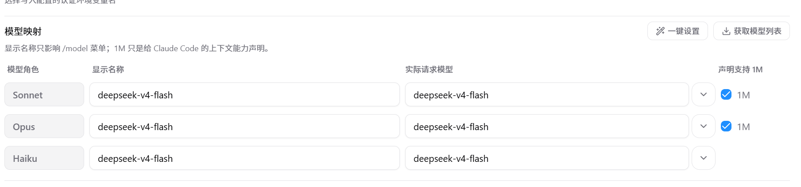
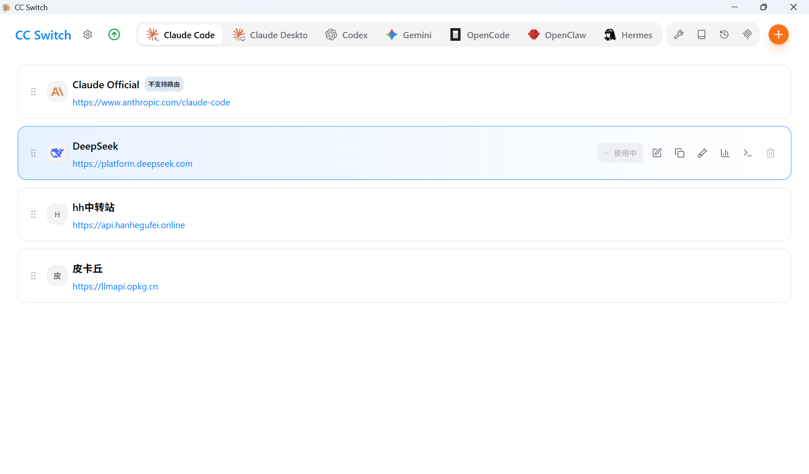

# Vibe Coding 入门：让 AI 帮你写代码

**在 AI 光速发展的当下，vibe coding 早已不是程序员的专属工具了；试着掌握它吧，享受它为你带来的大脑皮层光滑以及钱从口袋里飞速溜走的感觉。**

> 2025 年，Andrej Karpathy 造了一个词叫"Vibe Coding"——你不用写代码，只用"描述你想要什么"，然后 AI 帮你写。这篇文章带你从零上手这套全新的开发范式。
> 预计阅读时间：25-30 分钟。

---

## 什么是 Vibe Coding？

2025 年初，前 OpenAI 联合创始人、前 Tesla AI 总监 Andrej Karpathy 在推特上发了一句话：

> "There's a new kind of coding I call 'vibe coding', where you fully give in to the vibes, embrace exponentials, and forget that the code even exists."

翻译过来大概是：**有一种新的写代码方式，我叫它"感觉编程"——你完全跟着感觉走，拥抱指数增长，甚至忘记代码的存在。**

显然他说的是真的。

Vibe Coding 的本质是：**你用自然语言描述想要什么，AI 生成代码，你审查结果，不行就继续描述、让 AI 改，直到满意。** 你无需逐行敲代码，只用像一个产品经理在跟程序员沟通——只不过这个程序员是 AI，而且响应速度以秒为单位。

---

## 为什么要学 Vibe Coding？

迄今为止，大部分人的思想都停留在"vibe coding 就是用来给程序员减负的"，当然也有相当一部分傻逼大叫着"哦嘞嘞哦啦啦，程序员要被 AI 取代喽"然后自顾自地跑开


我们先不用管这种人

总之呢，vibe coding 是当下阶段最便宜最便捷的能够帮你减轻负担的工具，会和不会能让你的大学生活乃至整个人生有完全不一样的体验

**甚至，我大学期间所有科目的复习都是把复习资料一股脑发给豆包然后让它帮我讲解题目以及涉及的知识点，这又何尝不是一种vibe coding（**

---

## 为什么当下这件事变得可行了？

Vibe Coding 并非突然冒出来的。它是几个条件同时成熟的结果：

1. **模型能力够了**：2026 年的 Claude Fable 5、DeepSeek-V4、GPT-5.x 在代码生成上的准确率已经足够高。权威代码能力测试（真实项目里的 bug 修复任务）的通过率从 2024 年的三四成飙升到 2026 年的九成以上。

2. **工具链成熟了**：Cursor、Windsurf、Claude Code、GitHub Copilot 这些工具不再是"高级自动补全"，而是能理解整个项目上下文、跨文件修改、自主调试的协作伙伴。

3. **成本降下来了**：2024 年用 AI 写一个中型功能可能要花几十美元 API 费，2026 年同等任务可能只要几毛钱——甚至很多工具提供按月订阅随便用的模式。

4. **开发者心态变了**：新一代开发者不再觉得"手写每一行代码"是技术能力的证明。用 AI 写代码就像当年从手写账本切换到 Excel——并非只是为了"偷懒"，重要的在于"把精力花在更有价值的地方"。

---

## 主流工具一览

2026 年 Vibe Coding 的工具生态已经分化成几个流派：

| 工具               | 类型         | 适合谁                           | 价格（2026） |
| ------------------ | ------------ | -------------------------------- | ------------ |
| **Cursor**         | 智能编辑器   | 经常写网页和后台的人             | $20/月       |
| **Windsurf**       | 智能编辑器   | 追求顺手好用的人                 | $15/月       |
| **GitHub Copilot** | 编辑器插件   | 已经在用 VS Code 写代码的人      | $10/月       |
| **Claude Code**    | 终端工具     | 习惯敲命令行、跟服务器打交道的人 | 按用量计费   |
| **v0 (Vercel)**    | 网页生成工具 | 做界面和设计的人                 | 免费版可用   |
| **Bolt / Lovable** | 整站生成工具 | 不会写代码、想快速做个应用的人   | $20-50/月    |

**怎么选？**

- 如果你**经常做网页和界面**，Cursor 或 Windsurf 上手最快——你描述想要什么样子，AI 帮你写代码。
- 如果你**主要跟数据和服务器打交道**，Claude Code 在终端里直接改代码、跑测试、修 bug 的体验极其流畅。
- 如果你**完全不会写代码**但想做一个应用，你可以用大白话描述一整个应用，它帮你连界面带后台一块生成出来。
- 另外，作为当下最炫酷最时髦最简便最好用的 vibe coding 方案，Claude Code 搭配 CC switch 能让你在终端里随心换用各种 AI 模型，值得一试。

---

## 核心工作流：描述 → 生成 → 审查 → 迭代

Vibe Coding 并非"把需求扔给 AI，喝杯咖啡回来收代码"。实际工作流更像是这样的循环：

### 第一步：描述（Prompt）

给 AI 一个清晰的、有边界的任务描述。好的 prompt 应该足够清晰：

```
帮我做一个个人简介网页页面：
- 顶部放一张圆形头像图，右边是名字和一句话介绍
- 下面分三个段落：关于我、我的技能、联系方式
- 整体风格简洁干净，背景用浅灰色
- 手机上也能正常显示
```

不好的 prompt：

```
帮我做个网页
```

——这太模糊了，AI 不知道你要什么内容、什么风格、放哪里。
他不是你的对象，没有能力揣测你内心的想法。

### 第二步：生成

AI 生成代码，你看着它一行行往外蹦，像看着聊天框里"对方正在输入中"一样。

这时候你大概率不需要逐行检查代码怎么写出来的——AI 的格式和写法一般不会出大错。你要看的是：
- 做出来的东西是你要的吗？
- 各种意外情况考虑到了吗（比如图片加载不出来会怎样）？
- 风格跟你预期的一致吗？

### 第三步：审查（Review）

生成完了，快速扫一遍。重点关注：

- **内容对不对**：该有的信息都写上了吗？
- **看起来正常吗**：排版有没有跑偏？图片有没有裂？
- **点按钮有用吗**：链接能点开吗？表单能提交吗？
- **手机上能看吗**：缩小浏览器窗口试试，布局不乱就 OK

当然，本身不懂代码的话可以暂时不用管代码层面的事，又不是造火箭，能跑的就是好车。

### 第四步：迭代

对结果不满意？直接说：

```
头像太小了，放大一点；技能部分改成三个小卡片并排；整体背景改成米白色
```

AI 会基于刚才的上下文（它知道文件在哪、结构什么样）直接修改，你不需要重新描述整个需求。

然后再次审查 → 再次迭代 → 直到满意。

**关键原则：你永远是最后一道关。** AI 生成的代码你要是敢直接上生产，那就叫赌博了。Vibe Coding 的正确姿势是"AI 写初稿，你来把关"。额不过你大概看不懂它在写什么，所以最好还是拥有一点编程的能力。

---

## 写好 Prompt 的五个技巧

Vibe Coding 的质量上限，很大程度取决于你 prompt 的质量。

### 1. 给上下文，不只给指令

```
❌ 差：写一个登录页面

✅ 好：帮我做一个个人博客首页。风格参考 Medium，简洁干净。
       包含：顶部导航栏（首页、归档、关于我）、文章列表（先放 3 篇示例文章）、
       右侧放"关于我"简介和几个标签。整体用白色背景、深灰文字。
```

### 2. 用"约束"替代"自由发挥"

```
❌ 差：帮我把这个页面弄好看点

✅ 好：把这个页面的排版优化一下。重点看：
       1. 段落间距是不是太密了，每段之间稍微拉开一点
       2. 标题和正文的大小对比够不够明显
       3. 整体的颜色搭配舒不舒服
       内容一个字都不要改，只调样式。
```

### 3. 一次一个任务

```
❌ 差：帮我做个完整的个人网站，要有首页、相册、留言板、暗黑模式、还有后台管理

✅ 好：（分几轮对话）
       第1轮：先做一个简单的自我介绍页面
       第2轮：加一个照片墙，图片可以点开放大
       第3轮：加一个留言板区域（访客可以写名字和留言）
       第4轮：整体调一下配色和字体，让它更好看
```

AI 一次处理太多任务容易顾此失彼。拆小、拆细、逐步推进。

### 4. 提供"好的标准"

```
✅ 好：帮我做一个"夜间模式"切换按钮。参考我网站上现有按钮的颜色和圆角风格。
       要求：点击后整个页面背景变深灰色、文字变浅色，切换要平滑过渡。
```

告诉 AI "参照什么"比从零描述更高效。

### 5. 把报错直接贴给 AI

比如

```
我点"提交留言"按钮之后页面没反应。浏览器按 F12 打开控制台，显示：
Uncaught TypeError: Cannot read properties of null
在 contact.js 第 42 行。
帮我看看怎么回事，怎么修。
```

AI 读报错的能力非常强。不要自己瞎猜半天，直接把错误信息贴给 AI 就行。

---

## 常见坑和避坑指南

### 坑 1：生成完直接跑，不看代码

AI 偶尔会写出"看起来能跑但逻辑有微妙错误"的代码。比如日期计算差了一天，或者边界条件处理反了。**至少快速扫一遍核心逻辑。**

### 坑 2：无限迭代，越改越糟

改了五轮还是不满意，AI 开始"瞎改"——在无关的地方加代码、删掉之前正确的部分、引入新的 bug。**这时候正确的做法是：回退到最后一版满意的，换一个角度重新描述需求。**

### 坑 3：上下文太长，AI 开始"遗忘"

一次对话超过几百行代码后，AI 会忘记你一开始说的约束。**大任务拆成小会话，每次只关注一个模块或一个文件。**

### 坑 4：过度依赖，能力退化

用 AI 写了几个月网页，关上 AI 发现连最简单的页面都搭不出来了——这不是危言耸听。**Vibe Coding 的正确姿势：AI 写的时候你要看懂它大概在干什么。不懂的地方停下来学，而不是跳过。**

### 坑 5：敏感信息泄露

不要把公司机密、账号密码、客户数据贴到云端 AI 工具里。**涉及敏感内容时，优先用可以离线运行的本地工具，或者至少看清楚工具的隐私政策。**

---

## 什么时候适合 Vibe Coding，什么时候不适合？

| 适合                                   | 不适合                             |
| -------------------------------------- | ---------------------------------- |
| 增删改查类页面（博客列表、用户设置页） | 底层算法（排序、加密、通信协议）   |
| 重复性搬砖（给十个页面配一样的导航栏） | 要求极致速度的核心功能             |
| 界面和布局（按钮、卡片、表单排版）     | 需要深厚行业知识的专业逻辑         |
| 写测试检查功能是否正常                 | 安全相关代码（登录验证、权限控制） |
| 整理已经能跑的代码（改命名、拆大文件） | 你完全不懂的领域                   |
| 快速做个原型看效果 / 个人小项目        | 给一个老项目做大范围改动           |

一个有用的判断标准：**如果让你自己写，你清楚地知道"正确的结果长什么样"，那就可以让 AI 写。如果你自己也不知道正确答案是什么，AI 更不可能知道。**

---

## 上手实操：Claude Code + DeepSeek V4 Flash

目标：在 Windows 上装好 Claude Code，通过 CC Switch 接入 DeepSeek（便宜、性能不错且国内能不挂梯子直接用），然后用它做一个小项目。

> 整个过程大约 20 分钟，只需要跟着一步步来。

---

### 第一步：一条命令装 Claude Code

按 `Win` 键，输入 `PowerShell`，右键选**以管理员身份运行**。

把下面这行粘贴进去，回车：

```
irm https://claude.ai/install.ps1 | iex
```

等它跑完（大概一两分钟），Claude Code 就装好了。什么都不用管，Node.js 也不用单独装——它自己全包了。

> 如果报错"无法加载文件"之类的红字，先在 PowerShell 里执行这一句：`Set-ExecutionPolicy RemoteSigned -Scope CurrentUser`，输入 `Y` 确认，然后再跑上面那条安装命令。

装完后关掉当前窗口。随便在哪打开一个新的命令行（Win + R → 输入 `cmd`），输入 `claude --version`，看到版本号就说明装好了。

---

### 第三步：下载安装 CC Switch

CC Switch 是一个免费桌面工具，用来切换 Claude Code 使用的 AI 模型——不用它的话 Claude Code 只能连 Anthropic 的付费 API，用它就能换成 DeepSeek。

**下载地址**：[github.com/farion1231/cc-switch/releases](https://github.com/farion1231/cc-switch/releases)

打开后你会看到一个网页（GitHub Releases 页面），往下滑找到 **Assets** 那三个小字，点它展开文件列表。找到文件名里带 **Windows.msi** 的那一个（比如 `CC-Switch-v3.18.0-Windows.msi`），点击下载。

> 什么是 GitHub Releases？GitHub 是个存代码的网站，Releases 就是作者打包好的"可以直接用的版本"。你不用管它的代码，只下载 `.msi` 文件就行——就像平时下载软件安装包一样。

下载完后双击 `.msi` 文件（可能提示危险，点信任就行），然后一路点"下一步"装好。桌面会出现 **CC Switch** 图标。

---

### 第四步：获取 DeepSeek API Key

API Key 就像是一把"钥匙"，证明你有权限打开 DeepSeek 的"大门"。

1. 打开浏览器，访问 **[platform.deepseek.com](https://platform.deepseek.com)**，注册一个账号（应该用邮箱就行）
2. 登录后在左侧菜单找到 **API Keys**（API 密钥）
3. 点 **创建新的 API Key**，随便起个名字，比如"claude-code"，然后点创建
4. **立刻复制那一串 `sk-` 开头的字符！** 关闭后就再也看不到了（当然，忘了也没关系，重新创建一个就行）

DeepSeek 按使用量收费，新用户有免费额度（不确定现在还有没有，有的话够你试用一阵子了）。后面觉得好用再充值，用多少充多少。

---

### 第五步：在 CC Switch 里配置 DeepSeek

1. 双击桌面 **CC Switch** 图标打开
2. 顶部有一排图标，点最左边那个 **Claude Code** 图标
3. 点右上角的 **+** 按钮，在供应商列表里找到 **DeepSeek**，点击选中
4. 把刚才复制的 API Key 粘贴到 **API Key** 输入框里,然后在 **请求地址** 框里填 https://api.deepseek.com/anthropic
5. 在 **模型映射** 那里点获取模型列表，然后三个位置全选 `deepseek-v4-flash` 就好啦（找不到的话也可以手动输入）

6. 点 **添加** 保存
7. 回到主界面，点 DeepSeek 那一行右边的开关，变成 **启用** 状态


> 如果提示"需要路由"，点左上角齿轮 → **路由** → 把"路由总开关"和你对应工具的开关都打开。

---

### 第六步：跑起来

关掉所有命令行窗口，重新打开一个新的。输入：

```
claude
```

如果一切正常，你会看到 Claude Code 启动的欢迎界面。

先试试它能不能正常响应：

```
你是谁？
```

如果能正常回答，说明配置成功，即使它说自己是claude（它不一定说自己是 deep seek ，因为模型是有幻觉的，能输出就证明已经跑通了，毕竟你又没给 claude 充钱，它是不会免费给你用的）

然后试一试做一个小项目。比如：

```
生成一个纯HTML单文件番茄钟，25分钟倒计时，有开始暂停重置三个按钮，UI简洁好看。
浏览器能直接打开的那种。
```

AI 生成文件后，在文件管理器里找到它，双击用浏览器打开看看效果。哪里不满意直接跟 AI 说（比如"字体太小了，改成 48px"），直到满意。

---

### 如果你卡住了

| 现象                         | 检查                                                   |
| ---------------------------- | ------------------------------------------------------ |
| `claude` 不是命令            | 关掉命令行重开，还不行就重启电脑                       |
| CC Switch 找不到 DeepSeek    | 确认 CC Switch 是最新版，去 GitHub Releases 重新下载   |
| 启动 Claude Code 后 401 报错 | API Key 填错了或者复制漏了，去 DeepSeek 后台重新建一个 |
| 换了模型但没生效             | 关掉所有命令行窗口，重新打开再试                       |

---

## 总结

Vibe Coding 改变了写代码的姿势，但没改变做事的本质：**你需要知道做成什么样才算好，才能让 AI 做出好东西。**

- AI 是你的"超级实习生"——干活快、不知疲倦，但需要你把关
- 你的角色从"搬砖的"变成了"指挥 + 验收的"
- 把想法说清楚的能力，会比亲手写代码本身更重要

2026 年，不会用 AI 写代码的人正在成为新的"不会用搜索引擎的人"——离了 AI 完全能干活，不过效率差了不止一个数量级。

---

## 延伸阅读（有功夫的话瞎jb看看吧，反正我没看过）

- Andrej Karpathy, "Vibe Coding", Twitter/X, Feb 2025. https://x.com/karpathy/status/1886192044808729058
- Cursor Official Documentation, 2026. https://docs.cursor.com
- Claude Code Official Documentation, 2026. https://docs.anthropic.com/en/docs/claude-code
- Windsurf Official Documentation, 2026. https://docs.windsurf.com
